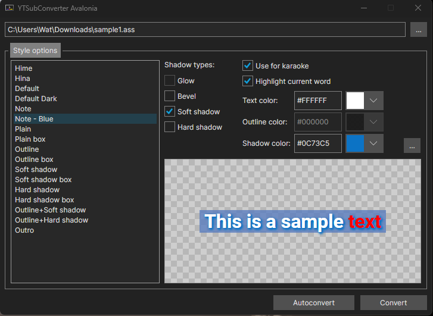

# YTSubConverterAvalonia

It's [YTSubConverter](https://github.com/arcusmaximus/YTSubConverter), but implemented in Avalonia UI

I made this mostly for fun and to learn about using YTSubConverter.Shared and improve on my MVVM skills for use in a
different project, but figured it
would be interesting to share.
Since it uses the YTSubConverter.Shared library, it implements all the same features that YTSubConverter has, but just
with a different UI library.

## Compared to YTSubConverter.UI.Win/Mac/Linux

|                            | YTSubConverterAvalonia | YTSubConverter.UI.X |
|----------------------------|:----------------------:|:-------------------:|
| YTSubConverter Conversions |          Yes           |         Yes         |
| Unified platform UI code   |          Yes           |         No          |
| Drag & Drop Files          |    Yes1     |         Yes         |
| Dark Theme                 |          Yes           |         No          |
| System tray application    |     No2     |         No          |

1 Drag & Drop is only supported on Windows &
macOS, [not on Linux due to limitations in Avalonia's drag & drop
support.](https://github.com/AvaloniaUI/Avalonia/issues/6085)

2 Soon™ (hopefully)

## Credits

- [arcusmaximus](https://github.com/arcusmaximus/) – For creating YTSubConverter and the YTSubConverter.Shared library,
  which made this project possible.

## Things to do

Got time and want to commit? Here's things that could be done:

- Implement system tray application support when using auto-convert mode
- Implement UI localization using the ResX files in YTSubConverter.Shared