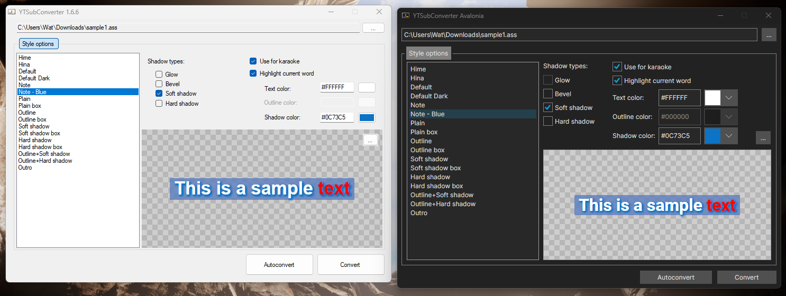
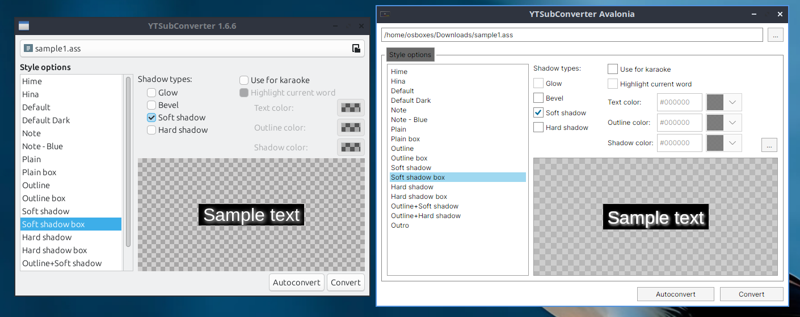

### YTSubConverterAvalonia - Migration Writeup (Avalonia Port Challenge)

[YTSubConverter](https://github.com/arcusmaximus/YTSubConverter) is a .NET application used by YouTube Timed Text subtitle designers to convert Advanced Substation Alpha subtitles into YouTube Timed Text. YTT subtitles created via YTSubConverter are most abundant within the Vocaloid and Utaite music sphere of YouTube, but are expanding into new genres as time goes on, and have grown into a niche but beloved feature of the site. Through every step of YTT's small history, YTSubConverter has been the backbone of it all.

Some notable videos using YouTube Timed Text subtitles created via YTSubConverter include:

[Kikuo - Aishite, Aishite, Aishite](https://www.youtube.com/watch?v=NTrm_idbhUk) (Bangla, English, French, Hindi, Indonesian)

[AnythingBecomeMoe - YARARARA](https://www.youtube.com/watch?v=T24rF_x0TmQ) (English, Korean, Latin American Spanish)

[VANTA - JANE DOE cover](https://www.youtube.com/watch?v=slj6ONZ5VUE) (English)

Starting development in late 2018, the converter initially targeted WinForms presumably since it was a quick and dirty solution to make a UI for a small application. This left out both Linux and macOS users, which would result in development of GtkSharp and Xamarin.Mac user interfaces. YTSubConverter currently is built out of 5 different projects; the shared library, a test library, and the three user interfaces.

#### What benefits does an Avalonia port bring to YTSubConverter

Although YTSubConverter's UIs are in a "feature complete" state, being built between three distinct UI platforms has caused inconsistencies in the UI, and means any future feature additions require three times the frontend development effort. Rather than play a slow, several years long game of inconsistency whack-a-mole to only be left with a subpar frontend development environment, why not just unify the project under the modernized UI frameworks of 2026? This wasn't the primary reason I started development, in fact, I just wanted a dark mode UI on Windows, but unification became the primary benefit found within an Avalonia UI port.

#### The migration process

Thankfully, YTSubConverter's multi-UI structure made migration to a new user interface a light process. All the subtitle conversion business logic is held inside YTSubConverter.Shared, which is accessed through the UI projects. This meant bulk of the porting process was directly lifting code from MainForm.cs of YTSubConverter.UI.Win to build up my MainWindowViewModel.cs with changes as needed to fit within MVVM architecture.

There are a few notable exceptions where Avalonia and MVVM needed its own considerations within the port:

Axaml made implementing localization a breeze; YTSubConverter's UIs had to call a LocalizeUI method in it's MainForm.cs to update its form with ResX localized strings during the form initialization, while in axaml the ResX localization could be called directly by the controls.

Handling the karaoke color system also seemed like it would be a tough process since I was not familiar with Avalonia converters. YTSubConverter uses C#'s System.Drawing colors, while Avalonia's color picker uses Avalonia's colors. Initially I had static methods within my ViewModel to perform conversions, but shifting to using converters within the axaml meant my MainWindowViewModel.cs code could be closer to the code seen in MainForm.cs.

The biggest surprise of the implementation process was making the subtitle style preview function. YTSubConverter.UI.X uses a WebView that updates directly with Html information from YTSubConverter.Shared's preview generator. At the time of development, Avalonia's NativeWebView had just went open source: I was able to get it working by using the preview generator output as a URL with "data:text/html;charset=utf-8;base64," to set the Source property of the NativeWebView. While now the documentation includes the NavigateToString method, the URL source method plays a little nicer with MVVM and keeping out of the code-behind behind as much as possible.

The last notable challenge I had was in recreating the expand/collapse style options of YTSubConverter.UI.Win. MainForm.cs could just directly change its height, but MVVM doesn't allow that. I was able to recreate this in MVVM with a WeakReferenceMessenger from the ViewModel to the code-behind when the style options button is toggled.

The core takeaway from this migraiton is that .NET applications that already host multiple UI projects for platform support are prime candidates for migration to Avalonia. Good delination of business logic within YTSubConverter reduced the difficulty of migration down to only having to consider for MVVM and axaml.

#### The costs

The biggest technical loss in going from platform focused UIs to a single unified UI was performance and filesize. YTSubConverter.exe on Windows has a lean 500kb portable executable, while Avalonia drags this up to almost 200MB with a pile of dependencies, with RAM usage becoming 4x higher. This mostly stems from three issues: one is with YTSubConverter.Shared being on .NET standard 2.0 which doesn't support trimming assemblies (I have to bring it in directly because the NuGet version doesn't include ITextMeasurer which breaks some functionality), the second issue is something with NativeWebView that causes single file output to stop playing nice, and lastly my own choice to deploy as self-contained (if I'm going to have size/footprint issues, I might as well go all in on them and get a little bit of benefit).  For a small application that aims for portability, this is a rough pill to swallow.

In terms of an individual cost to me, I'd consider this "free" and to be of learning value rather than cost to myself. Making YouTube Timed Text subtitles is a big hobby of mine, and creating YTSubConverterAvalonia has served as a stepping stone towards a larger Avalonia UI project using the YTSubConverter library.

#### Side by Side

###### YTSubConverter.UI.Win => YTSubConverterAvalonia, Windows 11 in dark theme

YTSubConverterAvalonia's UI design was based on YTSubConverter.UI.Win, although I chose to freestyle the UI layout rather than go for a strict pixel-to-pixel layout. The style preview background selector button couldn't be placed overtop the style preview due to what I assume is airspace issues in the NativeWebView control.

###### YTSubConverter.UI.Linux => YTSubConverterAvalonia, LXQt in light theme

A handful of features are lacking in YTSubConverter.UI.Linux: only the file name is shown rather than full file path, style options are not contained within a groupbox and cannot be hidden, and the background image of the style preview cannot be adjusted. Since YTSubConverterAvalonia shares UI code between all three of the target platforms, the structure seen in YTSubConverter.UI.Win is losslessly brought over to Linux compared to the GTKSharp based YTSubConverter.UI.Linux at zero extra development cost. I initially didn't even know the GTK UI version was lacking in these features!

(Unfortunately, I do not own a macOS device to compare YTSubConverter.UI.Mac to YTSubConverterAvalonia...)

#### In numbers

YTSubConverter was built over 62 commits primarily over two weeks in April 2026, with occasional development throught the year.

|                                                                     |YTSubConverterAvalonia|YTSubConverter.UI.Win|YTSubConverter.UI.Mac|YTSubConverter.UI.Linux|Combined YTSubConverter.UI.X|
|---------------------------------------------------------------------|-|-|-|-|-|
| Lines of code, counted via [CLOC](https://github.com/aldanial/cloc) |743 C#, 165 AXAML, 908 Total|1,732 XML, 552 C#, 391 C# Designer, 2,675 Total|1,220 XML, 706 C#, 289 C# Designer, 275 JSON, 2,490 Total|945 C#, 429 Glade, 1,374 Total|2,952 XML, 2,203 C#, 680 C# Designer, 429 Glade, 275 JSON, 6,539 Total|
| Targeted platforms                                                  |3 (Win, macOS, Linux)|1|1|2 (Functional on Windows)|3 (Win, macOS, Linux)|